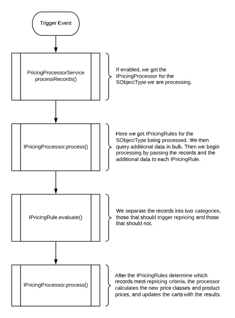

# Cart Pricing Framework

## Background

Nimble AMS allows us to calculate the price of products based on the person who is purchasing them. Before someone adds a product to their cart, we calculate the price they should pay. The Cart Pricing Framework allows us to reprice the products that have already been added to a cart - repriced cart items will pass through the configured bulk pricing manager `GetPriceClasses` and `GetProductPrices` methods. We do this by analyzing changes made to the cart items or cart item lines in that cart.

This is accomplished by processing CartItem__c and CartItemLine__c records at certain trigger events. For CartItem__c records: **onAfterInsert**, **onAfterUpdate**, and **onAfterDelete**. For CartItemLine__c records we support **onBeforeUpdate**.

There are two interfaces that are used to handle the processing of these records: IPricingProcessor and IPricingRule. IPricingProcessor is used to gather all the data we need to determine whether or not to reprice. Once we have determined which carts should be repriced, IPricingProcessor is responsible for actually updating those carts with the new prices. IPricingRule is used to determine if a record meets criteria that would warrant repricing. Basically, IPricingProcessor uses the IPricingRules to figure out when to reprice, then IPricingProcessor reprices carts if necessary.



## Configuration

There are some enablement steps to complete along with some metadata we need to be familiar with in order to use this framework.

You **must** create a Pricing Processor for repricing to work, even if no additional data is required for the Pricing Rule.

**LMA Access Required**

This is not intended to be used by anyone without LMA access at this time. All configuration for the Cart Pricing Framework requires you to be logged in through the LMA.

#### **How do I enable the pricing framework?**

The **PricingSettings__c** custom hierarchical setting is used to enable the framework. Hierarchical settings allow us to have unique values for particular users and profiles. Enabling this framework is as simple as creating a new record and checking some boxes. Before doing that, there are a few fields you need to be familiar with.

**Enable Cart Repricing:** A checkbox field that tells our Cart Item and Cart Item Line triggers that we can automatically apply pricing updates to carts.

**Enable Product Repricing:** This checkbox field is specific to our Bundle API. When checked, it tells our Bundle API to recalculate the prices of products just before adding them to a cart. The Bundle API calculates special pricing when we first request a bundle so that we can present it to the user. Sometimes, the user makes changes such as editing the quantity before paying for a bundle. This checkbox makes sure the prices are still accurate.

**Record Types:** This field lets us specify the record types of products that should be repriced. Here you will enter a comma separated list of record types. Specifying the record types allows us to avoid overriding a price that may have been entered by a user. For example, users often specify the amount they would like donate.

**Community Hub Only**

While the pricing framework could be used for all users, it is highly recommended that it only be enabled for Community Hub users. The Staff View order process has not been updated to handle scenarios where prices are automatically being adjusted after saving changes to CartItem__c and CartItemLine__c records.

#### **How do I configure my custom pricing processor?**

The **PricingProcessor__mdt** custom metadata type is used to specify the IPricingProcessor implementation that should be used for specific **SObjectType**.

1. Go to **Setup > Develop > Custom Metadata Types**.
2. Create a new record or edit an existing one.
3. For **Label** and **Pricing Processor Name**, enter whatever value you find most helpful.
    1. These values are not critical to functionality. They are strictly for your reference!
4. For **Class**, enter the name of the class which implements **IPricingProcessor**.
5. For **SObject Type**, enter the **API name** of the records this class should be used for.

#### **How do I configure custom pricing rules?**

The **PricingRule__mdt** custom metadata type is used to specify IPricingRule implementations which should be used for a specific **SObjectType**.

1. Go to **Setup > Develop > Custom Metadata Types**.
2. Create a new record or edit an existing one.
3. For **Label** and **Pricing Rule Name**, enter whatever value you find most helpful.
    1. These values are not critical to functionality. They are strictly for your reference!
4. For **Class**, enter the name of the class which implements **IPricingRule**.
5. For **SObject Type**, enter the **API name** of the records this class should be used for.

## Example

Lets look at a use case where we want to give member prices to any Community Hub user who is purchasing a new membership. Even if someone is not currently a member, we want to give them a discount just for purchasing a membership. We will want to make sure that the membership is either for the account making the purchase or for their primary affiliation.

We will reprice a cart when:

- A membership cart item is added to a cart for the bill to account or bill to's primary affiliation.
- A membership cart item is removed from a cart for the bill to account or bill to's primary affiliation.

To accomplish this, we will:

1. Create a CartItem__c formula field for the Cart__c record's Bill To account.
2. Implement IPricingProcessor for the CartItem__c SObjectType.
3. Implement IPricingRule for the CartItem__c SObjectType.
4. Configure PricingSettings__c, Pricing Processors and Pricing Rules.

### Create Custom Field

First, we will want to create our new CartItem__c field. We want a formula field that will return the BillTo__c account from the parent Cart__c record. Since this framework is used within triggers, formula fields can give us information about related records without having to do extra queries!

Let's make sure our formula field has an API name of **BillTo**.

### Create Pricing Processor

Next, we will implement the IPricingProcessor interface so that we can query additional account information. IPricingProcessor is responsible for querying additional data and updating records with new prices. This can be a lot to implement so we have provided a base class that will handle calculating prices with the Special Pricing Manager and updating the carts with the results. All we have to do is query our additional account information!

If you are merely configuring the pricing framework to be used, use the CartItemPricingProcessor apex class below.

```apex
/**
 * @description Does nothing but is required for repricing to work.
 */
public class CartItemPricingProcessor extends NU.CartPricingProcessor {
    /**
     * @description Does nothing but is required for repricing to work.
     */
    public override NU.PricingProcessorResponse process(NU.PricingProcessorRequest request) {
        return super.process(request);
    }
 
    /**
     * @description Does nothing but is required for repricing to work.
     */
    public protected override Map<String, Object> getAdditionalData(NU.PricingProcessorRequest request) {
        return new Map<String, Object>();
    }
}
```

Here is an example with more complex logic

```apex
/**
 * @description This class will handle extend the NU.CartPricingProcessor class to query additional data.
 */
global class CartItemPricingProcessor extends NU.CartPricingProcessor {
 
    private static final String ACCOUNTS = 'Accounts';
 
    /**
     * @description This method is implemented on the base NU.CartPricingProcessor class. It will get the IPricingRules for
     *              the NU__CartItem__c SObjectType and provide them with the additional data from getAdditionalData(). This method
     *              will then use the results from the IPricingRules to reprice and update the carts.
     * @param request The NU.PricingProcessorRequest containing the records to process.
     * @return An NU.PricingProcessorResponse.
     */
    global override NU.PricingProcessorResponse process(NU.PricingProcessorRequest request) {
        return super.process(request);
    }
 
    /**
     * @description Gathers bill to and customer account Ids from the cart item records then queries the accounts with those Ids.
     *              The queried accounts are then stored in a map.
     * @param request The request containing the Cart Item records to gather account Ids from.
     * @return A map containing the bill to and customer accounts.
     */
    global protected override Map<String, Object> getAdditionalData(NU.PricingProcessorRequest request) {
        Set<Id> accountIds = getAccountIds(request);
 
        Map<Id, Account> accountsById = new Map<Id, Account>(
                (List<Account>)AccountSelector.newInstance().selectById(accountIds));
 
        return new Map<String, Object> { ACCOUNTS => accountsById };
    }
 
    private Set<Id> getAccountIds(NU.PricingProcessorRequest request) {
        Set<Id> accountIds = new Set<Id>();
 
        List<NU__CartItem__c> cartItems = (List<NU__CartItem__c>)request.Records;
 
        for (NU__CartItem__c item : cartItems) {
            accountIds.add(item.NU__Customer__c);
            accountIds.add(Id.valueOf(item.BillTo__c));
        }
 
        return accountIds;
    }
}
```

### Create Pricing Rule

Next, we will implement the IPricingRule interface in order to create a rule that tells us which CartItem__c records should trigger repricing of their cart. Our IPricingRule implementation will receive the CartItem__c records that need to be evaluated along with the additional data queried by our CartItemPricingProcessor.

Using the additional data, our Pricing Rule will tell the Pricing Processor which CartItem__c records trigger repricing by sorting them into two separate lists.

If you are merely configuring the pricing framework to be used, use the CartItemPricingRule apex class below.

```apex
public without sharing class CartItemPricingRule implements NU.IPricingRule {
    private Map<String, Schema.RecordTypeInfo> recordTypeInfosByName;
 
    public NU.PricingRuleResponse evaluate(NU.PricingRuleRequest request) {
        NU.PricingRuleResponse response = new NU.PricingRuleResponse();
 
        List<NU__CartItem__c> recordsToEvaluate = (List<NU__CartItem__c>)request.Records;
 
        for (NU__CartItem__c item : recordsToEvaluate) {
            if (cartShouldBeRepriced(item)) {
                response.RecordsToPrice.add(item);
            } else {
                response.RemainingRecords.add(item);
            }
 
        }
 
        return response;
    }
 
    private Boolean cartShouldBeRepriced(NU__CartItem__c itemRecord) {
        //don't reprice if the cart is $0 balance, otherwise coupon item lines could be removed.
        NU__Cart__c relatedCart = [SELECT Id, NU__Total__c  FROM NU__Cart__c WHERE Id = :itemRecord.NU__Cart__c];
 
        return relatedCart.NU__Total__c != 0;
    }
}
```

If you need more complex logic, use the following example

```apex
/**
 * @description This class will identify membership cart items that should trigger repricing.
 */
global class MembershipPricingRule implements NU.IPricingRule {
 
    private static final String ACCOUNTS = 'Accounts';
    private static final String MEMBERSHIP = 'Membership';
 
    private Map<String, Schema.RecordTypeInfo> recordTypeInfosByName;
 
    /**
     * @description Separates a list of NU__CartItem__c records into two separate lists, one for those that
     *              should trigger repricing and one for those that do not.
     * @param request The NU.PricingRuleRequest containing the records to evaluate along with additional data
     *                provided by the IPricingProcessor.
     * @return An NU.PricingRuleResponse.
     */
    global NU.PricingRuleResponse evaluate(NU.PricingRuleRequest request) {
 
        NU.PricingRuleResponse response = new NU.PricingRuleResponse();
 
        Map<Id, Account> accountsById = getAccountData(request);
 
        List<NU__CartItem__c> recordsToEvaluate = (List<NU__CartItem__c>)request.Records;
 
        for (NU__CartItem__c item : recordsToEvaluate) {
            if (cartShouldBeRepriced(item, accountsById)) {
                response.RecordsToPrice.add(item);
            } else {
                // If the record didn't meet the criteria for repricing, add to the RemainingRecords
                // list so it can be evaluated by other rules.
                response.RemainingRecords.add(item);
            }
        }
 
        return response;
    }
 
    private Boolean cartShouldBeRepriced(NU__CartItem__c itemRecord, Map<Id, Account> accountsById) {
        if (!isMembership(itemRecord)) {
            return false;
        }
 
        Account billTo = accountsById.get(itemRecord.BillTo__c);
        Account customer = accountsById.get(itemRecord.NU__Customer__c);
 
        // If the membership is for the bill to or their primary affiliation, return true.
        return billTo.Id == customer.Id || customer.Id == billTo.NU__PrimaryAffiliation__c;
    }
 
    private Boolean isMembership(NU__CartItem__c itemRecord) {
        return itemRecord.RecordTypeId == getMembershipRecordTypeId();
    }
 
    private Id getMembershipRecordTypeId() {
        if (recordTypeInfosByName == null) {
            recordTypeInfosByName = NU__CartItem__c.SObjectType.getDescribe().getRecordTypeInfosByName();   
        }
         
        return recordTypeInfosByName.get(MEMBERSHIP).getRecordTypeId();
    }
 
    private Map<Id, Account> getAccountData(NU.PricingRuleRequest request) {
        Object accountData = request.Context.get(ACCOUNTS);
 
        return accountData == null ? new Map<Id, Account>() : (Map<Id, Account>)accountData;
    }
}
```

### Configure

The last thing we need to do is make sure everything is configured.

!> You must create a Pricing Processor for repricing to work, even if no additional data is required for the Pricing Rule.

!> **LMA Access Required** Remember that you need LMA access to do the following configuration steps.

#### **Pricing Settings**

To enable cart repricing and specify the record types of the products that should be repriced:

1. Go to **Setup > Develop > Custom Settings**.
2. Go to **PricingSettings__c** and click manage.
3. Create a new record for the **Community Hub Login User** profile.
    1. It is not recommended that this framework be enabled for all users. The Staff View order process has not been updated to handle automatic repricing of carts.
4. Set **Enable Cart Repricing** to true.
5. For **Record Types**, enter a comma separated list of the product record types which should be repriceable.
    1. Advertising,Exhibitor,Membership,Merchandise,Miscellaneous,Registration,Sponsorship,Subscription
    2. It is probably safe to assume that everything except Donations is repriceable.
6. Save your changes!

#### **Pricing Processors**

We also need to configure our pricing processor.

1. Create a new PricingProcessor__mdt record.
2. Enter NU__CartItem__c for the SObject Type field.
3. Enter CartItemPricingProcessor for the Class field.
4. Save your record!

#### **Pricing Rules**

Lastly, make sure we have configured our pricing rule.

1. Create a new PricingRule__mdt record.
2. Enter NU__CartItem__c for the SObject Type field.
3. Enter CartItemPricingRule for the Class field.
4. Save your record!

## Conclusion

Congratulations! You've learned how to use the Cart Pricing Framework.
