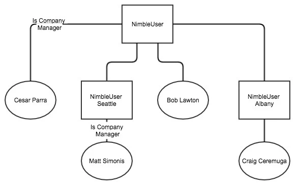
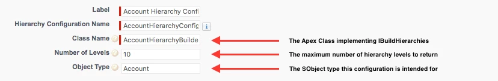

# Hierarchy Service

## Background

With the release of the Affiliations functionality in Community Hub, a need arose. That need was the ability to represent SObject records in tree-like hierarchies of objects, for the purposes of display, interaction and editing. The first use case was for affiliation hierarchies.

### Affiliations Use Case

Within Nimble AMS, individual accounts can be the company manager for a given affiliation. A company manager is typically given permission to do things like manage rosters, update company specific information, update individual's information within the company, etc. When an individual is a company manager of a parent company that has branches, that individual should also be given the same permissions to the branches under that parent company, and the branches under those branches (and so forth).

Because an account can have multiple affiliations, the **`NU__Affiliation__c`** object links child and parent accounts. A typical company's hierarchy might look like the following.



!> Note: Each rectangle represents an organization account, each oval represents an individual account, and each line connecting the accounts represents an affiliation record.

In this sample hierarchy, **Cesar** should be able to manage **NimbleUser Albany**, **NimbleUser Seattle**, and **Bob**, as well as **Craig** and **Matt**.

**Matt** should be able to manage **NimbleUser Seattle**, but **not NimbleUser or NimbleUser Albany**.

To accomplish determining which accounts had access to manage which company's and their roster, we built the **`NU.HierarchyService`**. This service will traverse down a hierarchy if you are the company manager for a company.

## The Process, Explained

### Custom Metadata Configuration

The ability to generate tree-like structures of SObject records was built generically. This means, that an Interface (**`NU.IBuildHierarchies`**) was created which describes a method for building hierarchies.

When a request is sent along to **`NU.HierarchyService`**, the service will look for any Hierarchy Configurations Custom Metadata Type records in the org based upon the SObject type of the record on the request.

As such, the records defining the implementation can be created via point and click, such as this example one for the affiliations hierarchies.

#### **Example Record**



!> **Head's Up!** At this time only **one** configuration record is allowed **per SObject type**. This was put in place to get us a solid base, with the opportunity to open it up to multiple in the future, if needed.

### The Request

To make a call to the **`NU.HierarchyService`**, you will need a **`NU.HierarchyRequest`** instance to pass along. This follows a standard request/response pattern seen throughout Nimble AMS.

```apex
// The request takes in the Id of an SObject record. This Id is then used to determine the type of the SObject you intend to build a hierarchy for.
// Then, a Custom Metadata Type Hierarchy Configuration record is searched for, to find the appropriate service to use when building a hierarchy.
Id accountId = NC.CommunityUser.getAccountId();
 
// Build the request instance.
NU.HierarchyRequest request = new NU.HierarchyRequest(accountId);
```

#### **Limited Request**

If you'd like to specifically call out how many hierarchy tree levels you would like to return, a constructor override is available which lets you specify the number of levels.

```apex
// The request takes in the Id of an SObject record. This Id is then used to determine the type of the SObject you intend to build a hierarchy for.
// Then, a Custom Metadata Type Hierarchy Configuration record is searched for, to find the appropriate service to use when building a hierarchy.
Id accountId = NC.CommunityUser.getAccountId();
 
// Build the request instance, limiting it to one level.
NU.HierarchyRequest request = new NU.HierarchyRequest(accountId, 1);
```

### The Hierarchy Service

Next, the request is passed into the hierarchy service and a response is returned.

**Warning**

When calling the **`NU.HierarchyService.Instance.getHierarchies`** method, take heed for the following circumstances will cause an exception to be thrown. You should **always** be vigilant when calling services, making sure to catch exceptions, log them to a place where an administrator can view them, while presenting the end user a much friendlier error message than the true exception.

- If the SObject record Id specified is an **invalid Id**, **does not belong to a known SObject type**, or **there is no Hierarchy Configurations Custom Metadata record configured** for that SObject type, an **`NU.ConfigurationException`** will be thrown stating "No IBuildHierarcies implementation is configured for the <SObject Type Here> SObjectType.".
- If the Apex class configured for a given SObject type cannot be found, a **`NU.ConfigurationException`** will be thrown stating "The class <Class Name Here> does not exist. Please check your Hierarchy Configuration\s class name.".
- If more than one configuration record exists for a given SObject type, a **`NU.ConfigurationException`** will be thrown stating "Multiple Hierarchy Configuration Records are configured for the <SObject Type Here> SObjectType."

```apex
// Call the service using the request instance, retrieving a response.
NU.HierarchyResponse response = NU.HierarchyService.Instance.getHierarchies(request);
```

### The Response / Traversing The Tree

After calling the service, you will receive a NU.HierarchyResponse instance which contains the following pieces of relevant information.

```apex
// Full request / response cycle call.
Id accountId = NC.CommunityUser.getAccountId();
NU.HierarchyResponse response = NU.HierarchyService.Instance.getHierarchies(request);
 
// The number of levels that the hierarchy covers.
System.debug('DEBUG: Levels: ' + response.Levels);
 
// The total number of nodes that exist in the hierarchies.
System.debug('DEBUG: Number of Nodes: ' + response.NumberOfNodes);
 
// The hierarchy generated for the specified SObject record Id.
System.debug('DEBUG: Hierarchies: ' + response.Hierarchy);
```

#### **The Hierarchies Object**

Contained within the response object instance is the **`Hierarchy`** property, containing the full **`NU.Hierarchies`** tree of SObject record Ids.

Each level of a hierarchy contains a number of **`NU.Node`** object instances. Each **Node** represents a portion of the tree, such as an individual who is a part of a company, or a sub-company below a parent company.

### Conclusion

The ability to generate hierarchical trees of SObject records is basic framework extensibility need. Through a combination of interfaces, apex code and point and click configuration, hierarchies of records can be built and constructed from outside of the package.
