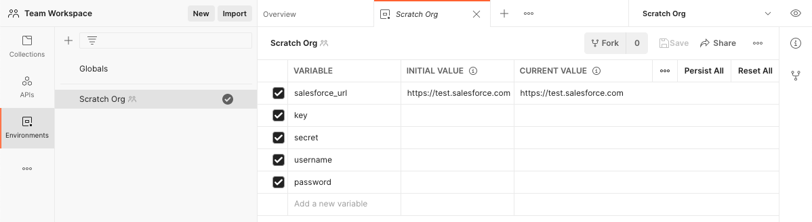
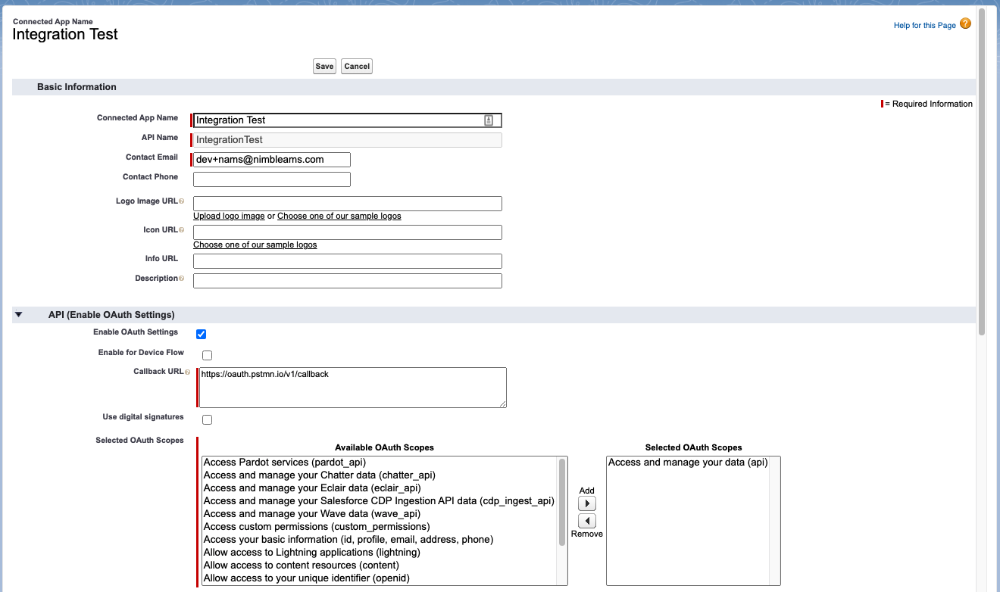
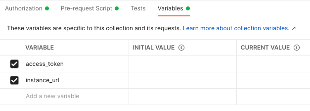
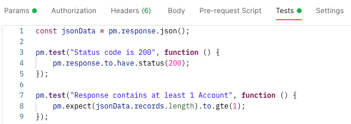

# Testing Salesforce REST with Postman Guide

This guide will walk you through configuring Postman to call into
Salesforce - either native or custom Apex REST endpoints.

## Postman

[Postman](https://www.postman.com/) is an app (web and desktop) centered
around API's and making REST calls. It makes it very easy to configure,
test, and distribute a collection of requests amongst a team, which is
ideal for development. To get started, sign up and use either the web or
desktop app.

## Authentication

The first step in making calls into Salesforce is authentication. This
allows you to access the API's and validate permissions.

To authenticate with Salesforce, we will be following the
[Authorization Through Connected Apps and OAuth 2.0](https://developer.salesforce.com/docs/atlas.en-us.api_rest.meta/api_rest/intro_oauth_and_connected_apps.htm)
flow. There are multiple ways to do this through Postman itself - JWT,
Web Server Flow, Username and Password. For this guide, we will be
creating a script so that we can store parts of the response as
variables, and using the username and password flow.

There is a
[Postman collection](https://www.postman.com/salesforce-developers/workspace/salesforce-developers/overview)
for interacting with Salesforce's REST API's. It includes examples for
many ways to authenticate.

### Environment

First you will want to create an environment to store your org-specific
information, and fill everything out in the Current Value.



Use the Current Value to store your org specific details. You will never
want to persist those to a team, and you can re-use that environment
with your next scratch org.

In your org, you will want to create a Connected App (Setup → App
Manager → New Connected App) and use the key and secret here.

Connected App details:



### Collection Authorization

The next part to handle authentication is a Pre-request Script in a
collection. This will ensure that you have a token for making API calls
each time you make a request, as well as adding the Bearer Token to the
request headers.

After you create a collection that will contain your REST calls,
configure it like so:



**Pre-request Script:**

```javascript
const tokenUrl = pm.variables.get("salesforce_url") + "/services/oauth2/token";
const clientId = pm.variables.get("key");
const clientSecret = pm.variables.get("secret");
const username = pm.variables.get("username");
const password = pm.variables.get("password");

const getTokenRequest = {
  method: "POST",
  url: tokenUrl,
  body: {
    mode: "formdata",
    formdata: [
      { key: "grant_type", value: "password" },
      { key: "client_id", value: clientId },
      { key: "client_secret", value: clientSecret },
      { key: "username", value: username },
      { key: "password", value: password },
    ],
  },
};

pm.sendRequest(getTokenRequest, (err, response) => {
  const jsonResponse = response.json();
  const newAccessToken = jsonResponse.access_token;
  const instanceUrl = jsonResponse.instance_url;

  pm.variables.set("access_token", newAccessToken);
  pm.variables.set("instance_url", instanceUrl);
});
```

With this in place, you can now make REST calls into Salesforce and not
need to think about authentication.

## REST Requests

Now that you have authentication setup, making REST requests is very
straightforward. This will walk you through setting up a SOQL query GET
request.

First create a new request under your collection that has authentication
configured. The endpoint you are going to call into is the Salesforce
REST query endpoint.


You will always want to use the `{{instance_url}}` variable to reference
your Salesforce org. This is what is returned from the OAuth handshake.

And... that's it! You can send the request, and see the response. You
can also write tests to assert that your endpoints are working as
expected.


