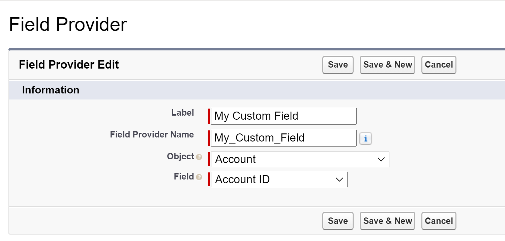

# Fields Providers

The `Fields Providers` framework determines which fields get queried anytime records are being retrieved
and loaded into a `Model` class for any API.

A repository of `Field Provider` classes acts as the sole source of truth for fields to query, which makes
it easy to ensure that newly created custom fields are queried, no matter where in the code.

But the `Fields Provider` framework goes a step beyond just providing a list of fields to query. It also dynamically
ensures that specialized fields are queried, based on whether they exist in the org or not. For example, when
Salesforce Multi-Currenty is turned on, a new field called `CurrencyIsoCode` is added to the appropriate SObject types. This
field does not exist when multi-currency is not on so the `Fields Provider` framework dynamically detects if the feature
is on and automatically adds the appropriate fields to queries.

## Usage

### Registering Fields

Before getting fields for your query it is important to first register the fields with the framework. There are 2 ways
to do this.

The first way is by creating a custom `nams.FieldsProviderBase` class and calling `FieldsProviderFactory.registerFieldsForSObjectType`.
For example:

[code](../../samples/fields-providers/classes/FieldsProvidersDocSamples.cls ':include :type=code apex :fragment=sample-provider')

After creating your provider you can register it to the `Fields Provider` framework as follows:

[code](../../samples/fields-providers/classes/FieldsProvidersDocSamples.cls ':include :type=code apex :fragment=registering-provider')

For most standard objects you will not need to create a new `nams.FieldsProviderBase`, as fields will be registered by default
from within the packaged code.

If you wish to retrieve all registered fields yourself, for example, for when you are building your own query, you can do so as follows:

[code](../../samples/fields-providers/classes/FieldsProvidersDocSamples.cls ':include :type=code apex :fragment=retrieving-fields')

## Providing Additional Fields

You might wish to register additional fields on top of the ones that might have already been registered by the packaged code, for example
when you have custom fields that the package does not know about. There are 2 ways to do this: programatically or declaratively.

### Programatically

To register additional fields programatically you can execute the following code:

[code](../../samples/fields-providers/classes/FieldsProvidersDocSamples.cls ':include :type=code apex :fragment=registering-fields')

### Declaratively

To make sure your custom fields are always queried the `Fields Provider` framework also comes with a Custom Metadata Type object, which
allows you to register specific fields for an SObject Type.

Go to
* Setup
* Search for Custom Metadata Types
* Locate the `Field Provider` type and click on `Manage Records`
* Click `New`

Here you can specify the field that you want to always be queried.
