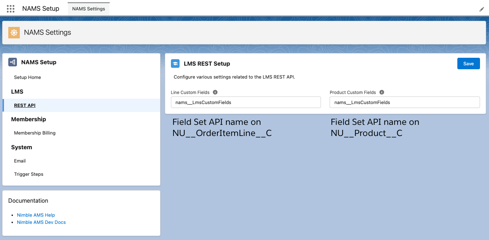

# LMS REST API

The LMS REST API is comprised of the following endpoints:

- `/lms/v1/products`
- `/lms/v1/purchases`

## Routes

### Products Route

The products route supports retrieving LMS eligible products -
products where the "Sync with LMS" checkbox is checked.

#### All LMS Products

All products can be retrieved by calling `/products` through a
`GET` request.

Sample response:

```json
[
  {
    "productType": "On-Demand",
    "name": "Nimble Data Fundamentals",
    "id": "a1Z0R000002KBLPUA4",
    "description": "Bring to the table win-win survival strategies to ensure proactive domination."
  },
  {
    "productType": "Live Webcast",
    "name": "Nimble Ethics",
    "id": "a1Z0R000002KBLKUA4",
    "description": "Leverage agile frameworks to provide a robust synopsis for high level overviews."
  },
  {
    "productType": "On-Demand",
    "name": "Nimble Communication Strategies",
    "id": "a1Z0R000002KBLLUA4",
    "description": "Capitalize on low hanging fruit to identify a ballpark value added activity to beta test."
  }
]
```

#### LMS Products by Last Updated Date

To filter the products being retrieved to those only updated
since a specific date, you can provide a `lastUpdated` URL
parameter in the request to the `/products` endpoint.

Use the `yyyy-MM-ddTHH:mm:ss.SSS+/-HH:mm` or `yyyy-MM-ddTHH:mm:ss.SSSZ` format.

Example: `/products?lastUpdated=2021-10-10T07:00:00Z`

ℹ️ [More info](https://developer.salesforce.com/docs/atlas.en-us.api_rest.meta/api_rest/intro_valid_date_formats.htm)
on Salesforce Datetime formatting for REST.

#### Single LMS Product

To retrieve a single product, you can provide the product ID in the URL
path: `/products/001...` (where `001...` is a Product record ID).

Sample response:

```json
{
  "productType": "On-Demand",
  "name": "Nimble Data Fundamentals",
  "id": "a1Z0R000002KBLPUA4",
  "description": "Bring to the table win-win survival strategies to ensure proactive domination."
}
```

### Purchases Route

The purchases route supports retrieving purchases made for LMS products.

#### All LMS Purchases

All purchases can be retrieved by calling `/purchases` through a
`GET` request.

Sample response:

```json
[
  {
    "syncStatus": "Success",
    "product": {
      "productType": "On-Demand",
      "name": "Nimble Communication Strategies",
      "id": "a1Z0R000002KBLLUA4",
      "description": "Capitalize on low hanging fruit to identify a ballpark value added activity to beta test."
    },
    "id": "a1J0R000001qKOcUAM",
    "externalId": null,
    "completionStatus": "In Progress"
  },
  {
    "syncStatus": "Pending",
    "product": {
      "productType": "On-Demand",
      "name": "Nimble Data Fundamentals",
      "id": "a1Z0R000002KBLPUA4",
      "description": "Bring to the table win-win survival strategies to ensure proactive domination."
    },
    "id": "a1J0R000001qKOdUAM",
    "externalId": null,
    "completionStatus": "In Progress"
  }
]
```

#### LMS Purchases by Last Updated Date

To filter the purchases being retrieved to those only updated
since a specific date, you can provide a `lastUpdated` URL
parameter in the request to the `/purchases` endpoint.

Use the `yyyy-MM-ddTHH:mm:ss.SSS+/-HH:mm` or `yyyy-MM-ddTHH:mm:ss.SSSZ` format.

Example: `/purchases?lastUpdated=2021-10-10T07:00:00Z`

ℹ️ [More info](https://developer.salesforce.com/docs/atlas.en-us.api_rest.meta/api_rest/intro_valid_date_formats.htm)
on Salesforce Datetime formatting for REST.

#### Single LMS Purchase

To retrieve a single purchase, you can provide the purchase ID in the URL
path: `/purchases/002...` (where `002...` is an Order Item Line record ID).

Sample response:

```json
{
  "syncStatus": "Success",
  "product": {
    "productType": "On-Demand",
    "name": "Nimble Communication Strategies",
    "id": "a1Z0R000002KBLLUA4",
    "description": "Capitalize on low hanging fruit to identify a ballpark value added activity to beta test."
  },
  "id": "a1J0R000001qKOcUAM",
  "externalId": null,
  "completionStatus": "In Progress"
}
```

#### LMS Purchase Sync

To update (or sync) a purchase with the AMS, you can call the
route for a single purchase with a `POST`.
The following properties are supported in the `POST` body:

```json
{
  "completionStatus": "Completed",
  "syncStatus": "Success",
  "externalId": "001931414"
}
```

## Including Custom Fields

The LMS API also supports adding custom fields to all endpoints through the use of Field Sets. This includes the `GET` endpoints in addition to the purchase sync `POST` endpoint.

Custom fields are added to the response payload in a `custom` object key.

```json
{
  "productType": "On-Demand",
  "name": "Nimble Data Fundamentals",
  "id": "a1Z0R000002KBLPUA4",
  "description": "Bring to the table win-win survival strategies to ensure proactive domination.",
  "custom": {
    "NU__UnitPrice__c": 19.99,
    "NU__ShortName__c": "DEMAND"
  }
}
```

When syncing purchases back to Nimble AMS, the `custom` object key can also be included in the payload.
These fields _must_ be included in the Field Set defined in setup.

```json
{
  "completionStatus": "Completed",
  "syncStatus": "Success",
  "externalId": "001931414",
  "custom": {
    "CreditUnits__c": 3
  }
}
```

### Configuring

To configure the Field Sets, you will need to first have the Setup package installed to access the setup UI.
After installed, navigate to the NAMS Setup app. In the left hand navigation, if the LMS package is installed, you should see an LMS REST API section.



On this page, you can set the Field Set API name to include in the Products endpoints, as well as the Field Set API name to include in the Purchases endpoints.

## Postman Collection

To easily test the API, there is a
<a href="/rest-apis/endpoints/lms/NAMS LMS API.postman_collection.json" download>Postman collection</a>
that can be imported into [Postman](https://www.postman.com/) for easy testing.

### Collection Variables

- `product_id` - An LMS Product Id to verify it exists in the `/products` response.
- `last_updated_date` - Date to use when calling the `/products` and `/purchases` endpoints for filtering by last updated date.
- `line_id` - An LMS Line Id to verify it exists in the `/purchases` response.

### Environment Variables

This collection uses environment variables to authenticate against a specific Salesforce org.

- `salesforce_url` - The Salesforce endpoint for login - test.salesforce.com, login.salesforce.com, or a custom MyDomain.
- `username` - The username of the user to log into Salesforce with.
- `password` - The password of the user to log into Salesforce with.
- `key` - The OAuth Key (Client ID) for the Connected App in Salesforce used for authentication.
  The Connected App should have the `api` OAuth scope.
- `secret` - The OAuth Secret for the Connected App in Salesforce used for authentication.

To learn more about using Postman and Salesforce, see the
[Testing Salesforce REST with Postman Guide](/development/recipes/rest/postman/).
